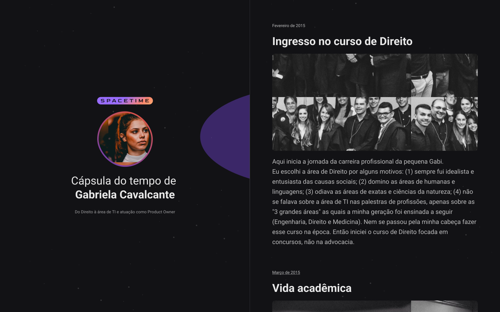

<h1 align="center">Time Capsule of my Carrer</h1>

Cápsula do Tempo da minha Carreira

Time capsule containing the most important moments of my career | Cápsula do tempo contendo os momentos mais importantes da minha carreira 

  <a href="#-tecnologias">Tecnologias</a>&nbsp;&nbsp;&nbsp;|&nbsp;&nbsp;&nbsp;
  <a href="#-projeto">Projeto</a>&nbsp;&nbsp;&nbsp;|&nbsp;&nbsp;&nbsp;
  <a href="#-layout">Layout</a>&nbsp;&nbsp;&nbsp;|&nbsp;&nbsp;&nbsp;
  <a href="#memo-licença">Licença</a>

  

 

  

## 🚀 Tecnologias

Esse projeto foi desenvolvido com as seguintes tecnologias:

- HTML e CSS
- JavaScript
- Git e Github
- Figma

## 💻 Projeto

Aplicação de recordação de memórias, onde o usuário poderá adicionar à uma timeline textos, fotos e vídeos de acontecimentos marcantes da sua vida, organizados por mês e ano.

- [Visite o projeto online](https://gabrielacvcnt.github.io/timeCapsuleMyCarrer)

## 🔖 Layout

Você pode visualizar o layout do projeto através [DESSE LINK](https://www.figma.com/file/d7CqgzA3F5QrJtQwkHKMvj/C%C3%A1psula-do-tempo-%E2%80%A2-Trilha-Explorer?type=design&t=AvPWcZxPQ2ux63dT-6). É necessário ter conta no [Figma](https://figma.com) para acessá-lo.

## :memo: Licença

Esse projeto está sob a licença MIT. Veja o arquivo [LICENSE](LICENSE) para mais detalhes.
